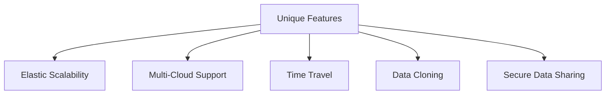
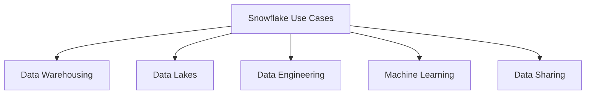

# Introduction
Snowflake is a cutting-edge cloud-native data warehousing solution designed to address the limitations of traditional systems. Its architecture emphasises scalability, performance, and flexibility by decoupling storage, compute, and services layers.

## Core Design Principles

1.  **Cloud-Native**: Fully optimised for cloud platforms like AWS, Azure, and GCP, leveraging their scalability and elasticity.
2.  **Decoupled Storage and Compute**: Compute and storage operate independently, enabling dynamic scaling.
3.  **Multi-Cluster Shared Data Architecture**: A blend of shared-disk and shared-nothing architectures for efficiency and concurrency.

## Unique Features

### Elastic Scalability

-   Compute and storage scale independently.
-   Allows dynamic allocation of resources for high performance.

### Multi-Cloud Support

-   Operates across AWS, Azure, and GCP.
-   Provides seamless replication and data sharing across clouds.

### Support for Semi-Structured Data

-   Natively handles JSON, Avro, Parquet, and XML.
-   Queries semi-structured data using SQL.

### Time Travel and Data Cloning

-   **Time Travel**: Access historical data for up to 90 days.
-   **Cloning**: Creates zero-copy clones for experiments without additional storage.

### Secure Data Sharing

-   Enables secure sharing of live data across Snowflake accounts without copying or moving data.

## Security Features

-   End-to-end encryption for data at rest and in transit.
-   Fine-grained permissions with role-based access control (RBAC).
-   Compliance with standards like SOC 2, GDPR, and HIPAA.

## Advantages of Snowflake Architecture

-   **Performance**: Query optimization ensures high-speed analytics.
-   **Flexibility**: Supports diverse data types and workloads.
-   **Cost-Effectiveness**: Pay-as-you-go model reduces unnecessary spending.
-   **Ease of Use**: No infrastructure management required; fully automated system.

## Use Cases

1.  **Data Warehousing**: Centralized repository for structured and semi-structured data.
2.  **Data Lakes**: Integration with data lakes for analytics.
3.  **Data Engineering**: Efficient ETL/ELT workflows.
4.  **Machine Learning**: Supports scalable data science processes.
5.  **Data Sharing**: Real-time collaboration without data duplication.

