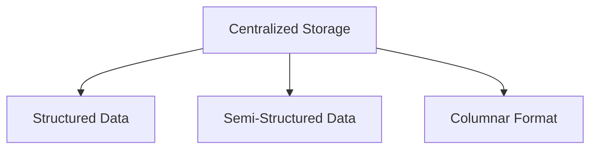
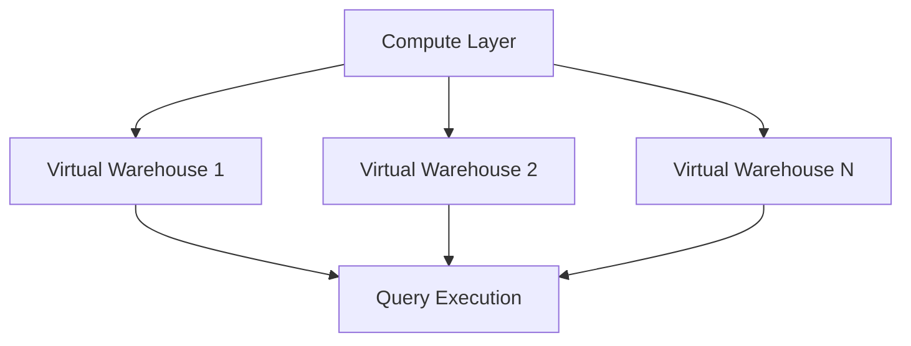
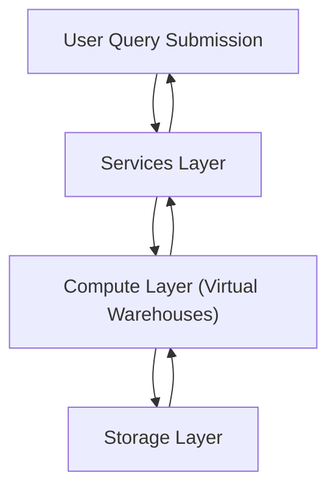

# Snowflake Layers

Snowflake’s architecture is divided into three primary layers: **Storage Layer**, **Compute Layer**, and **Services Layer**. These layers function together to provide a scalable, secure, and high-performance cloud data platform. Snowflake’s architecture is unique because it decouples these layers, allowing independent scaling and management of each one, making it more flexible and efficient.

## Storage Layer

The **Storage Layer** in Snowflake is responsible for the physical storage of data. It is highly scalable, secure, and efficient. This layer handles the actual data storage, data redundancy, and compression, while ensuring that Snowflake users don’t need to manage infrastructure or worry about capacity constraints.

### Key Features & Functionality

-   **Data Storage**:
    -   Stores all structured, semi-structured, and unstructured data (e.g., JSON, Avro, Parquet) in a **centralised repository**.
    -   Data is stored in **cloud object storage** (e.g., **Amazon S3**, **Azure Blob Storage**, or **Google Cloud Storage**), which scales automatically as data grows.
-   **Columnar Data Storage**:
    
    -   Snowflake uses a **columnar format** to store data, which helps to achieve high compression rates and efficient query performance.
    -   It supports automatic **compression** of data, which minimizes storage costs.
-   **Data Separation**:
    
    -   The Storage Layer is completely decoupled from the Compute Layer, allowing data to be shared across multiple compute clusters without duplication.
    -   Data remains **persistent** and is available for any compute cluster or user.
-   **Data Redundancy**:
    
    -   Snowflake provides built-in **data replication** and **failover** mechanisms. Data is automatically replicated within multiple availability zones for high durability and availability.
-   **Automatic Scaling**:
    
    -   **Scalability** of storage is managed by the cloud provider. Snowflake’s storage layer automatically scales to accommodate increasing data volumes, offering near-infinite storage without the user needing to manage it.

### Use Cases

-   Large data volumes: Snowflake's storage layer is designed to handle and scale with massive datasets, especially when dealing with unstructured or semi-structured data.
-   Data sharing: The decoupling of storage from compute makes data sharing between users and teams seamless and efficient.

## Compute Layer

The **Compute Layer** is responsible for running queries, executing data processing tasks, and performing analytics. This layer consists of **Virtual Warehouses**, which are independent clusters of compute resources that are responsible for query execution.

### Key Features & Functionality

-   **Virtual Warehouses**:
    
    -   Snowflake’s compute resources are organized into **Virtual Warehouses**, which are compute clusters that execute queries on the data stored in the Storage Layer.
    -   Each Virtual Warehouse operates independently and is completely isolated from other Virtual Warehouses, which allows for **workload isolation**. For example, one Virtual Warehouse can be used for ETL processes, while another handles interactive querying for analytics.
    -   Virtual Warehouses can be scaled **horizontally** (by adding more clusters) and **vertically** (by resizing the compute resources allocated to a single cluster).
-   **Multi-Cluster Warehouses**:
    
    -   Snowflake allows for **multi-cluster Virtual Warehouses**, where multiple compute clusters can operate concurrently, processing queries in parallel.
    -   This is ideal for environments with high concurrency (many simultaneous users or processes). Snowflake automatically scales the number of clusters based on the query load, ensuring that the system remains responsive even as demand increases.
-   **Resource Monitoring**:
    
    -   The compute layer is responsible for monitoring and managing resource usage. It adjusts compute resources dynamically depending on the load, ensuring optimal performance without over-provisioning.

### Use Cases

-   **Query Execution**: Running ad-hoc queries, reports, and complex analytics that require distributed compute power.
-   **ETL Processing**: Performing data transformation and processing jobs, which can be managed by dedicated compute clusters.
-   **Concurrent Workloads**: Handling many simultaneous queries without contention, ensuring high concurrency for users and workloads.

## Services Layer

The **Services Layer** is the brain of Snowflake, responsible for managing metadata, query optimization, access control, security, and other essential functions that enable Snowflake’s operation. This layer manages the overall orchestration of the platform, ensuring that the system is responsive, efficient, and secure.

### Key Features & Functionality

-   **Metadata Management**:
    
    -   The Services Layer maintains and manages metadata about databases, schemas, tables, columns, and other objects within the Snowflake environment.
    -   It tracks query history, schema changes, user roles, and permissions, ensuring smooth data management and governance.
-   **Query Optimization**:
    
    -   It handles the **query compilation and optimization** process. When a query is submitted, the Services Layer analyzes it and generates an optimal execution plan for the compute resources to execute.
    -   Snowflake leverages its **cost-based query optimizer** to ensure that queries are executed as efficiently as possible, considering factors like data distribution and indexing.
-   **Security & Authentication**:
    
    -   The Services Layer enforces **role-based access control (RBAC)** to ensure that users and processes have appropriate permissions to access data and perform operations.
    -   It manages user authentication, including integration with identity providers (e.g., SSO, OAuth) and controls data encryption both at rest and in transit.
-   **Transaction Management**:
    
    -   Ensures **ACID** (Atomicity, Consistency, Isolation, Durability) compliance for all transactions, ensuring data integrity even with concurrent operations.
-   **Task Scheduling and Resource Management**:
    
    -   The Services Layer schedules background tasks (like **data loading**, **data purging**, etc.) and manages the overall **resource allocation** for compute operations.

### Use Cases

-   **Data Governance**: Managing access control, user roles, and permissions.
-   **Query Performance**: Ensuring that queries are compiled, optimized, and executed as efficiently as possible.
-   **Transaction Integrity**: Enforcing ACID compliance for multi-step data operations.

## Interconnection of Layers

These layers interact to deliver a seamless experience:

#### **Step-by-Step Workflow**:

1.  **Query Submission**:
    
    -   A user submits a query through the **Services Layer**.
2.  **Query Optimization**:
    
    -   The Services Layer fetches metadata and generates an execution plan.
3.  **Data Retrieval**:
    
    -   The **Compute Layer** (Virtual Warehouse) processes the query, accessing data from the **Storage Layer**.
4.  **Result Delivery**:
    
    -   The query results are sent back to the user via the **Services Layer**.

