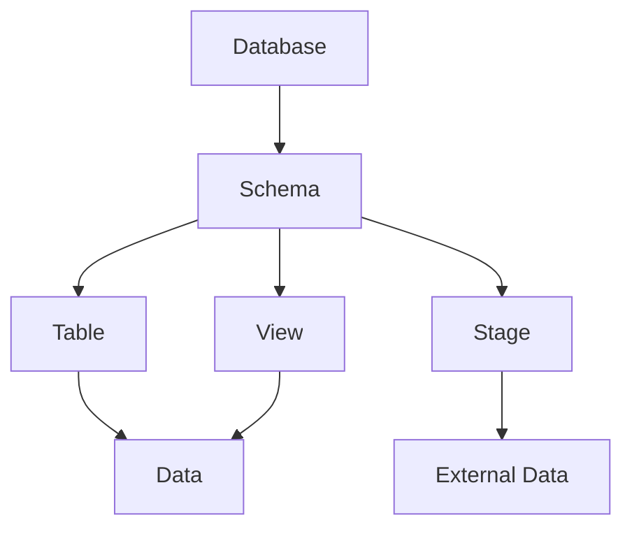

# Tables and Views

Tables and views are foundational components of any database system, including Snowflake. They play distinct roles in organizing, storing, and querying data. Understanding their structure, purpose, and features is essential for effective data management.

## Tables in Snowflake

A table is a structured collection of data stored in rows and columns, where each column has a specific data type. Tables are the primary objects for storing persistent or temporary data.

### Types of Tables in Snowflake

#### Permanent Tables
   - Default table type in Snowflake.
   - Data persists until explicitly deleted.
   - Supports features like Time Travel and Fail-safe for data recovery.

#### Transient Tables
   - Similar to permanent tables but do not support Fail-safe.
   - Used for temporary data that doesn’t require long-term recovery options.
   - Cost-effective for non-critical or intermediate data storage.

#### Temporary Tables
   - Exist only for the duration of the session in which they are created.
   - Automatically dropped when the session ends.
   - Useful for intermediate data processing.

#### External Tables
   - Reference data stored outside Snowflake, such as in cloud storage (e.g., Amazon S3, Google Cloud Storage).
   - Useful for querying external datasets without loading them into Snowflake.
   - Often used with stages to define the external storage location.

### Key Features of Tables

1. **Structured Data Storage**:
   - Tables define a fixed schema for the data they store, specifying column names and data types.

2. **Data Persistence**:
   - Permanent tables persist data until it is explicitly removed, while transient and temporary tables are ephemeral.

3. **Schema Enforcement**:
   - Tables enforce column data types and constraints (e.g., primary keys, unique constraints).

4. **Time Travel**:
   - Permanent and transient tables support Time Travel, allowing users to query historical versions of data.

5. **Cloning**:
   - Snowflake supports zero-copy cloning, enabling you to create clones of tables without duplicating data.

6. **Partitioning and Clustering**:
   - Tables can be clustered to optimize query performance by organizing data on specific keys.

## Views in Snowflake

A view is a virtual table that represents the result of a SQL query. Unlike tables, views do not store data themselves but fetch it from the underlying base tables when queried.

### Types of Views in Snowflake

1. **Standard Views**:
   - Execute the defined query each time they are accessed.
   - Provide real-time results from the underlying data.

2. **Materialized Views**:
   - Store the results of a query physically in Snowflake’s storage.
   - Provide faster query performance for complex computations by avoiding recomputation.
   - Must be refreshed explicitly or configured to refresh automatically.

---

### Key Features of Views

1. **Dynamic Data Representation**:
   - Views present data dynamically based on the defined query, ensuring the results reflect the current state of the underlying data.

2. **Simplified Querying**:
   - Views encapsulate complex SQL logic, making it easier to reuse and standardize queries.

3. **Logical Layer**:
   - Views provide an abstraction layer, allowing users to interact with data without needing to know the underlying table structure.

4. **Access Control**:
   - Permissions can be granted on views separately from the underlying tables, restricting access to sensitive data.

5. **Non-Persistent**:
   - Unlike tables, standard views do not persist data and only store the query definition.

6. **Materialized Views for Performance**:
   - Materialized views precompute and store results, significantly improving performance for repetitive or computationally intensive queries.

## Key Differences Between Tables and Views

| Feature                | Tables                              | Views                              |
|------------------------|-------------------------------------|------------------------------------|
| **Data Storage**       | Physically store data.              | Do not store data (except materialized views). |
| **Definition**         | Defined by schema and data.         | Defined by a SQL query.            |
| **Updates**            | Can be updated directly.            | Cannot be updated directly.        |
| **Performance**        | Queries access data directly.       | Queries are dependent on the query definition and underlying tables. |
| **Purpose**            | Used for persistent data storage.   | Used for presenting or summarizing data. |
| **Time Travel**        | Supported for permanent and transient tables. | Not supported.                     |
| **Materialized Option**| Not applicable.                     | Supported (materialized views).    |

## When to Use Tables vs. Views

### Use Tables When
- You need to store and manage persistent data.
- You require strong schema enforcement.
- The data needs to be updated frequently.
- Data recovery and Time Travel are critical.

### Use Views When
- You need a simplified or filtered representation of existing data.
- You want to encapsulate complex queries for reuse.
- You need to implement access control without duplicating data.
- Performance optimization through materialized views is a priority for repetitive queries.

## Best Practices

### For Tables
1. **Choose the Right Table Type**:
   - Use permanent tables for critical data, transient tables for intermediate storage, and temporary tables for session-specific processing.

2. **Define Clustering Keys**:
   - For large tables, define clustering keys to improve query performance.

3. **Leverage Time Travel**:
   - Use Time Travel for data auditing and recovery.

4. **Avoid Overloading One Table**:
   - Organize data into multiple tables based on logical separation to enhance query performance and maintainability.

5. **Secure Sensitive Data**:
   - Use Snowflake’s data masking and encryption features for secure storage of sensitive data.

### For Views
1. **Encapsulate Complex Logic**:
   - Use views to encapsulate frequently used queries and simplify data access.

2. **Use Materialized Views for Performance**:
   - When dealing with repetitive, computationally intensive queries, use materialized views to store precomputed results.

3. **Grant Permissions Carefully**:
   - Restrict access to sensitive data by creating views that expose only the required columns or rows.

4. **Avoid Overusing Views**:
   - Do not rely excessively on views for every operation, as this can lead to performance degradation when chaining multiple views.

5. **Monitor Materialized Views**:
   - Regularly monitor and refresh materialized views to ensure they reflect the current state of the underlying data.

## Everything in one diagram

